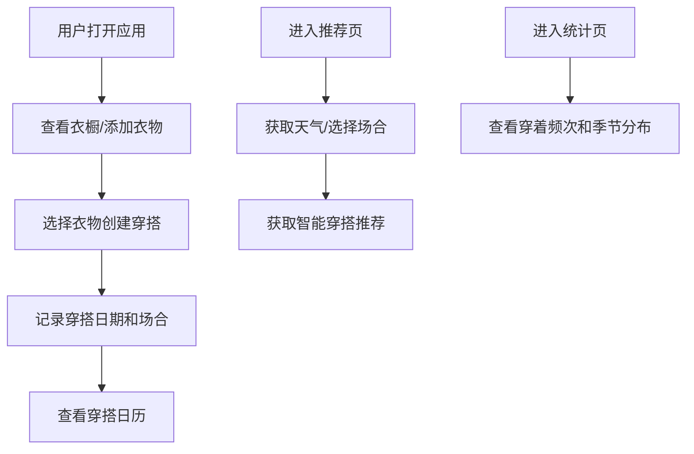

## 1. 产品概述

个人衣橱管理应用，帮助用户数字化管理衣物、记录日常穿搭、获取智能穿搭建议。解决用户"衣橱满仓却无衣可穿"的痛点，提升衣物利用率和穿搭效率。

- 面向追求时尚、注重生活品质的年轻用户群体
- 核心价值：衣橱数字化管理、穿搭灵感推荐、穿衣数据洞察

## 2. 核心功能

### 2.1 用户角色
| 角色 | 注册方式 | 核心权限 |
|------|----------|----------|
| 普通用户 | 本地存储，无需注册 | 管理衣橱、记录穿搭、查看推荐和统计 |

### 2.2 功能模块
1. **衣橱管理页**：衣物上传、分类网格展示、筛选搜索
2. **穿搭记录页**：创建穿搭组合、穿搭日历、历史记录
3. **智能推荐页**：天气获取、场合选择、穿搭推荐
4. **统计分析页**：穿着频次排行、季节分布图表

### 2.3 页面详情
| 页面名称 | 模块名称 | 功能描述 |
|---------|----------|----------|
| 衣橱管理 | 衣物上传 | 支持照片上传、填写类别/颜色/风格/季节/品牌/购买日期 |
| 衣橱管理 | 分类展示 | 按类别（上装/下装/外套/鞋子/配饰）网格展示衣物 |
| 衣橱管理 | 筛选搜索 | 支持多维度筛选和关键词搜索 |
| 穿搭记录 | 创建穿搭 | 选择多件衣物组合成一套、添加穿搭日期和场合标签 |
| 穿搭记录 | 穿搭日历 | 日历视图展示每日穿搭记录 |
| 智能推荐 | 天气获取 | 调用模拟天气API获取当地气温和天气状况 |
| 智能推荐 | 场合选择 | 用户选择上班/约会/运动等场合 |
| 智能推荐 | 穿搭推荐 | 根据天气和场合从衣橱推荐合适穿搭组合 |
| 统计分析 | 频次排行 | 展示穿着最多/最少的衣物排行榜 |
| 统计分析 | 季节分布 | 图表展示各季节衣物数量分布 |

## 3. 核心流程

## 4. 用户界面设计

### 4.1 设计风格
- **主色调**：暖米色（#F5F0E8）作为基底，搭配柔和的玫瑰棕（#B88678）和鼠尾草绿（#8B9A8A）
- **辅助色**：陶土橙（#D4A574）用于强调按钮和重要交互
- **按钮风格**：圆润胶囊形，微立体阴影，悬停时有轻微上浮效果
- **字体**：标题使用 "Playfair Display" 衬线字体，正文使用 "Lato" 无衬线字体
- **布局风格**：卡片式布局，柔和圆角（16px），大量留白，营造优雅时尚感
- **图标**：使用 Lucide 线性图标，统一1.5px线宽

### 4.2 页面设计概述
| 页面名称 | 模块名称 | UI元素 |
|---------|----------|--------|
| 衣橱管理 | 顶部导航 | 品牌logo、页面切换标签、添加衣物按钮 |
| 衣橱管理 | 分类筛选栏 | 类别标签横向滚动、颜色筛选、季节筛选 |
| 衣橱管理 | 衣物网格 | 响应式网格布局，卡片展示衣物缩略图和信息 |
| 衣橱管理 | 添加衣物模态框 | 图片上传区、表单字段、标签选择器 |
| 穿搭记录 | 日历视图 | 月历格子，有穿搭记录的日期显示缩略图 |
| 穿搭记录 | 创建穿搭 | 衣物选择区、穿搭预览、日期场合选择 |
| 智能推荐 | 天气卡片 | 天气图标、温度、天气状况描述 |
| 智能推荐 | 场合选择 | 场合标签按钮组 |
| 智能推荐 | 推荐结果 | 穿搭组合卡片、搭配说明 |
| 统计分析 | 频次排行 | 排行榜列表，进度条展示穿着次数 |
| 统计分析 | 季节分布 | 环形图或柱状图展示 |

### 4.3 响应式
- Desktop-first设计，最大宽度1440px
- 平板端（768px-1024px）：网格列数调整为3列，侧边导航收起为汉堡菜单
- 移动端（<768px）：网格列数调整为2列，底部标签导航

### 4.4 动画与交互
- 页面切换：淡入淡出过渡（300ms ease）
- 卡片悬停：轻微上浮（translateY(-4px)）、阴影加深
- 标签选择：缩放动画（scale(1.05)）+ 背景色过渡
- 图片加载：骨架屏占位，加载完成后淡入
- 模态框：从底部滑入，背景蒙层渐变
