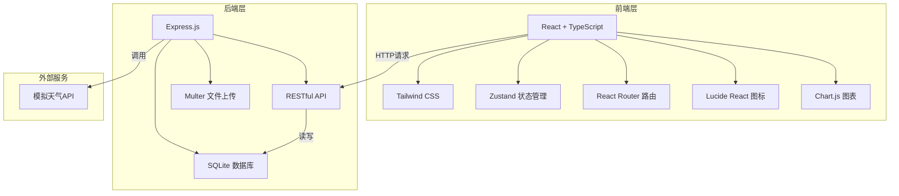
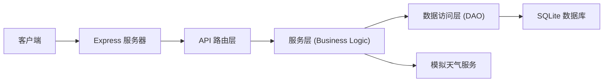
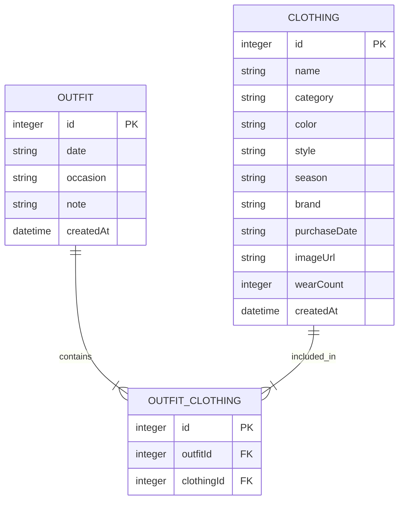

## 1. 架构设计



## 2. 技术描述

- **前端**：React@18 + TypeScript + Tailwind CSS@3 + Vite
- **后端**：Express@4 + TypeScript + SQLite
- **状态管理**：Zustand
- **路由**：React Router DOM@6
- **图表**：Chart.js + react-chartjs-2
- **图标**：Lucide React
- **文件上传**：Multer
- **数据库**：better-sqlite3

## 3. 路由定义

| 路由 | 页面 | 用途 |
|------|------|------|
| / | 衣橱管理页 | 展示衣物网格、添加衣物、筛选搜索 |
| /outfits | 穿搭记录页 | 穿搭日历、创建穿搭组合 |
| /recommend | 智能推荐页 | 天气获取、场合选择、穿搭推荐 |
| /stats | 统计分析页 | 穿着频次、季节分布图表 |

## 4. API 定义

### 4.1 衣物管理 API

```typescript
// 衣物类型定义
interface Clothing {
  id: number;
  name: string;
  category: 'top' | 'bottom' | 'outerwear' | 'shoes' | 'accessory';
  color: string;
  style: string[];
  season: string[];
  brand: string;
  purchaseDate: string;
  imageUrl: string;
  wearCount: number;
  createdAt: string;
}

// GET /api/clothes - 获取衣物列表
// Query: category, color, style, season, search
// Response: { data: Clothing[] }

// POST /api/clothes - 添加衣物
// Body: FormData (name, category, color, style, season, brand, purchaseDate, image)
// Response: { data: Clothing }

// PUT /api/clothes/:id - 更新衣物
// Body: Partial<Clothing>
// Response: { data: Clothing }

// DELETE /api/clothes/:id - 删除衣物
// Response: { success: boolean }
```

### 4.2 穿搭记录 API

```typescript
// 穿搭类型定义
interface Outfit {
  id: number;
  clothingIds: number[];
  date: string;
  occasion: string;
  note?: string;
  createdAt: string;
}

// GET /api/outfits - 获取穿搭列表
// Query: date, month, year
// Response: { data: Outfit[] }

// POST /api/outfits - 创建穿搭
// Body: { clothingIds, date, occasion, note }
// Response: { data: Outfit }

// DELETE /api/outfits/:id - 删除穿搭
// Response: { success: boolean }
```

### 4.3 推荐 API

```typescript
// 天气类型定义
interface Weather {
  temperature: number;
  condition: 'sunny' | 'cloudy' | 'rainy' | 'snowy';
  city: string;
}

// GET /api/weather - 获取天气
// Response: { data: Weather }

// POST /api/recommend - 获取穿搭推荐
// Body: { temperature, condition, occasion }
// Response: { data: { clothing: Clothing[], reason: string }[] }
```

### 4.4 统计 API

```typescript
// GET /api/stats/wear-frequency - 穿着频次
// Response: { data: { clothing: Clothing, count: number }[] }

// GET /api/stats/season-distribution - 季节分布
// Response: { data: { season: string, count: number }[] }
```

## 5. 服务器架构图



## 6. 数据模型

### 6.1 ER 图



### 6.2 DDL 语句

```sql
-- 衣物表
CREATE TABLE IF NOT EXISTS clothing (
  id INTEGER PRIMARY KEY AUTOINCREMENT,
  name TEXT NOT NULL,
  category TEXT NOT NULL CHECK (category IN ('top', 'bottom', 'outerwear', 'shoes', 'accessory')),
  color TEXT NOT NULL,
  style TEXT NOT NULL,
  season TEXT NOT NULL,
  brand TEXT,
  purchaseDate TEXT,
  imageUrl TEXT NOT NULL,
  wearCount INTEGER DEFAULT 0,
  createdAt DATETIME DEFAULT CURRENT_TIMESTAMP
);

-- 穿搭表
CREATE TABLE IF NOT EXISTS outfit (
  id INTEGER PRIMARY KEY AUTOINCREMENT,
  date TEXT NOT NULL,
  occasion TEXT NOT NULL,
  note TEXT,
  createdAt DATETIME DEFAULT CURRENT_TIMESTAMP
);

-- 穿搭-衣物关联表
CREATE TABLE IF NOT EXISTS outfit_clothing (
  id INTEGER PRIMARY KEY AUTOINCREMENT,
  outfitId INTEGER NOT NULL,
  clothingId INTEGER NOT NULL,
  FOREIGN KEY (outfitId) REFERENCES outfit(id) ON DELETE CASCADE,
  FOREIGN KEY (clothingId) REFERENCES clothing(id) ON DELETE CASCADE
);

-- 索引
CREATE INDEX IF NOT EXISTS idx_clothing_category ON clothing(category);
CREATE INDEX IF NOT EXISTS idx_outfit_date ON outfit(date);
CREATE INDEX IF NOT EXISTS idx_outfit_clothing_outfit ON outfit_clothing(outfitId);
CREATE INDEX IF NOT EXISTS idx_outfit_clothing_clothing ON outfit_clothing(clothingId);
```
